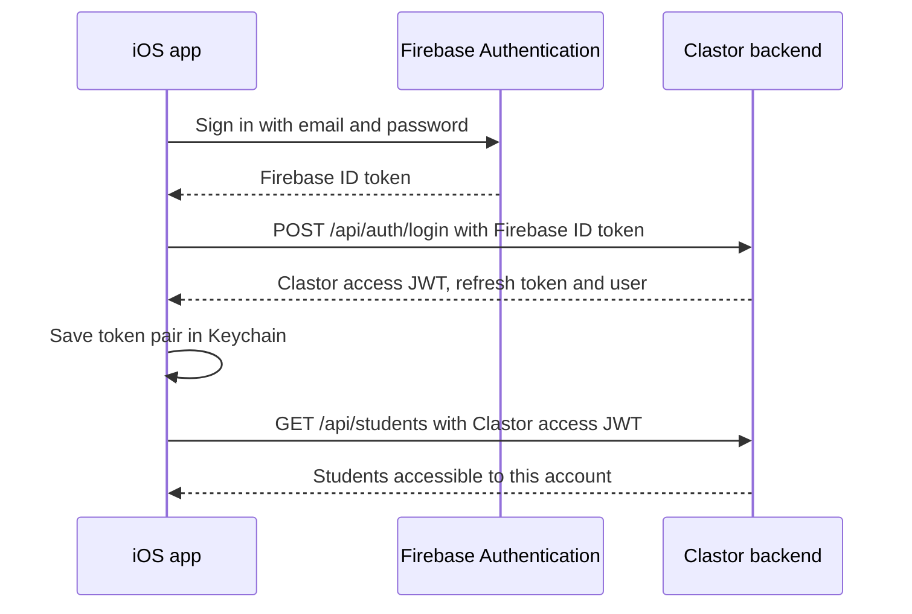

# Native iOS authentication and app scaffold

Status: the email/password milestone and five-tab scaffold are implemented.
Reviewed: 16 September 2026. This document replaces the original planning
checklist; later account-management and provider flows remain separate work.

## Implemented flow



Firebase handles passwords. The backend verifies identity, supplies the user
profile, issues Clastor tokens and enforces roles and record ownership. The
native app only enters its signed-in state after backend success and secure
storage succeed. A Firebase session alone does not unlock the app.

The tab order is Home, Students, Calendar, Payments and Profile. Students shows
names from the selected backend in a native list, with loading, empty, failure,
retry and pull-to-refresh states. The remaining tabs are blank scaffolds with
page titles; Profile has a Sign out button. Student records are held in memory.

| Component | Responsibility |
|---|---|
| `Configuration/AppConfiguration.swift` | Validate environment, bundle ID and API origin |
| `Auth/FirebaseAuthService.swift` | Email/password identity authentication and Firebase sign-out |
| `Auth/AuthAPI.swift` | Backend login, verification, refresh and logout |
| `Auth/KeychainTokenStore.swift` | Store and replace the token pair atomically as one Keychain item |
| `Auth/SessionStore.swift` | Session lifecycle, authenticated requests and coordinated refresh |
| `Networking/BackendClient.swift` | Uncached requests with bounded timeouts and redirect rejection |
| `Students/StudentsAPI.swift` | Authenticated `GET /api/students` |
| `Navigation/MainTabView.swift` | The five main tabs |

Paths in this table are relative to `ios/Clastor/Clastor`. See the
[iOS setup guide](../ios/README.md) for schemes, local Firebase configuration
and build/test commands.

## Session lifecycle

- The Clastor token pair uses a non-synchronizing Keychain item with
  `kSecAttrAccessibleWhenUnlockedThisDeviceOnly`. Passwords are not persisted.
  UserDefaults contains only a non-secret signed-out marker.
- Keychain namespaces include the bundle ID, environment, Firebase project and
  API origin, preventing credentials from being reused across deployments.
- Launch restores and verifies a stored session before showing protected UI.
  Foreground verification preserves the tab hierarchy when the session remains
  valid. Verification outages offer retry without deleting credentials.
- A protected request's `401` shares the existing verification/refresh task and
  retries at most once. Permission errors do not trigger a refresh loop.
- Rotation records an in-progress marker before contacting the server. An
  interrupted or ambiguous rotation requires sign-in again rather than replaying
  a potentially consumed refresh token. A refresh rate-limit response preserves
  the original token because the backend rate limiter runs before consumption.
- Logout immediately removes local credentials and signs out of Firebase.
  Backend refresh-token revocation is best-effort with a five-second timeout.
  Session generation checks reject late responses after logout/account changes.
- Backend access tokens expire after 15 minutes; rotating refresh tokens expire
  after 30 days. Revoking a refresh token does not itself immediately invalidate
  an already-issued access token. The backend separately checks account status
  and original authentication time in its session verification/refresh flow.

The backend hardening and API contract changes are already on the `mobile`
base branch. See [the auth rollout notes](auth-hardening-rollout.md) and the
[OpenAPI contracts](../interfaces/src/openapi.yaml).

## Public repository boundaries

| Information | Where it belongs |
|---|---|
| Bundle IDs, Firebase project IDs, API origins and Apple team identifiers | Public client/build configuration |
| Firebase Apple client plist and local xcconfig overrides | Ignored local files; contributors supply their own matching configuration |
| Firebase Admin private keys, JWT signing secrets, OAuth client secrets and SMTP credentials | Backend secret storage; never in the app or repository |
| Apple private signing keys, certificates containing private keys and provisioning profiles | Local secure storage or protected CI storage |
| User passwords, access JWTs and refresh tokens | Never source control, fixtures, logs or analytics |

Firebase client configuration is extractable from a built app and is not a
server credential. Keeping its source file ignored is repository hygiene, not
an authorization boundary. Backend authorization and Firebase configuration
must remain effective independently of client source visibility.

Dev permits HTTP only for localhost; Staging and Production require HTTPS.
Physical-device builds reject localhost because it refers to the phone.
Production requires explicit configuration and does not fall back to Staging.

The transport rejects redirects before bearer credentials can follow them.
Client-facing failures do not expose raw server bodies or Firebase error
metadata. Debug preview/UI-test dependencies use synthetic identities and data;
Release excludes those dependencies and the test-mode flag.

GitHub secret scanning and push protection are enabled. The secret-scan workflow
covers PRs and pushes to `main` and `mobile`, scanning reachable Git history with
redacted output. Enable the included local staged-file check with:

```sh
git config --local core.hooksPath .githooks
```

Do not bypass a secret finding. Revoke or rotate an exposed credential before
assessing history cleanup; deleting a file alone does not invalidate it. Report
vulnerabilities through the [security policy](../SECURITY.md).

## Contracts and validation

Swift auth and student DTOs are generated from the existing YAML schemas. Run:

```sh
npm run build:swift-auth --workspace=interfaces
npm run build:swift-students --workspace=interfaces
npm run check:swift-auth --workspace=interfaces
npm run check:swift-students --workspace=interfaces
python3 ios/Clastor/Scripts/test_prepare_firebase.py
```

CI checks generated models, tests environment boundaries using synthetic Firebase
plists, runs the web/backend checks and scans Git history. It does not currently
compile or run the native app; Xcode validation remains a local check.

Validation for this milestone includes simulator test-target compilation, an
unsigned iPhone Release-Staging build, 38 core tests in a temporary macOS harness,
and 12 build-configuration tests. The core harness substitutes only the Firebase
adapter factory; tests inject fake services and never use real credentials.
The iOS-specific Keychain attributes and UI tests still need an iOS runtime run:
automation was blocked by the temporary simulator's startup. Release binaries
were checked for absence of test-mode markers and synthetic preview identities.

To verify live data, run Dev or Staging in Simulator, sign in and open Students.
Compare the names against the web app using the same account and environment.
This live check is distinct from offline test fixtures.

## Remaining work

- Native registration and interrupted-signup recovery.
- Password recovery and email-verification actions in the native UI.
- Native Google/Apple sign-in, provider linking and separate Calendar consent.
- Account deletion, recent-authentication requirements and data cleanup.
- Product decisions for role-specific navigation, onboarding and supported iOS versions.
- A documented reinstall policy and physical-device lifecycle verification.
- Native build/UI-test CI using supported Xcode and simulator versions.
- Full Home, Calendar, Payments and Profile features.

Publishing this scaffold does not establish App Store readiness or complete a
security assessment of the deployed services. Dependency advisory remediation
and Firebase rules/IAM review remain deployment maintenance responsibilities.
